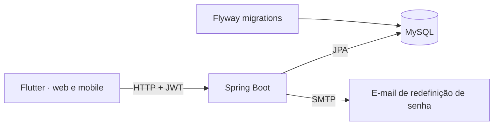

# Oficina Conectada

[](https://github.com/Lucaskalell/oficina-conectada/actions/workflows/ci.yml)

Sistema de gestão para oficinas mecânicas: ordens de serviço, clientes e veículos, estoque de peças, vendas, agendamentos e equipe de mecânicos. API em Spring Boot com MySQL e um app Flutter que roda na web e no celular.

> **English summary:** Oficina Conectada is a management system for auto repair shops covering work orders, customers and vehicles, parts inventory, sales, scheduling and mechanics. It has a Spring Boot REST API with JWT authentication, role-based access, MySQL and Flyway migrations, plus a Flutter app for web and mobile using BLoC. Code and docs are in Portuguese.

> **Sobre este projeto.** Comecei a Oficina Conectada em outubro de 2025, ainda na fase de estudos, e mantenho como registro da minha evolução. Ele recebe atualizações conforme aprendo coisas novas, então algumas partes ainda refletem decisões mais antigas, e o histórico de commits mostra esse caminho. Não tem fins comerciais.

## Estrutura

| Pasta | Stack | Descrição |
|---|---|---|
| [`backend/`](backend) | Java 24, Spring Boot 3.5, Spring Security, JWT, JPA, Flyway, MySQL | API REST com autenticação, regras de negócio e migrations |
| [`frontend/`](frontend) | Flutter, BLoC, Syncfusion Charts | App web e mobile consumindo a API |



## Módulos

| Módulo | O que faz |
|---|---|
| Autenticação | Login com JWT, troca obrigatória de senha no primeiro acesso e redefinição de senha por código enviado por e-mail |
| Dashboard | Faturamento do mês, ordens abertas, produtos com estoque baixo e gráfico de vendas |
| Ordens de serviço | Abertura vinculando cliente e veículo, itens de peça e mão de obra, fotos e histórico de status |
| Clientes e veículos | Cadastro de cliente com um ou mais veículos, inclusive na mesma requisição |
| Estoque | Categorias, subcategorias e produtos, com quantidade mínima, preço de custo e preço de venda |
| Vendas | Venda de produtos com baixa automática no estoque e bloqueio quando a quantidade não é suficiente |
| Agendamentos | Agenda de serviços por período, com status |
| Mecânicos | Cadastro da equipe. Cada mecânico ganha um usuário próprio, e desativar o mecânico bloqueia o login |

## Segurança

- Três perfis: `ADMIN`, `ATENDENTE` e `MECANICO`. Ações sensíveis ficam restritas ao admin com `@PreAuthorize`: cadastrar usuários, gerenciar mecânicos, excluir clientes e excluir itens do estoque.
- Todas as rotas exigem token, exceto login e redefinição de senha.
- A redefinição de senha nunca revela se um e-mail está cadastrado: a API responde da mesma forma nos dois casos. O código vai por e-mail, vale por uma hora e só pode ser usado uma vez. No banco fica apenas o hash SHA-256 do código.
- O primeiro administrador é criado na inicialização com a senha de `ADMIN_SENHA_INICIAL`. Sem essa variável, a senha é gerada aleatoriamente e aparece uma única vez no log. Nos dois casos a troca é obrigatória no primeiro acesso.

## Como rodar

Pré-requisitos: JDK 24, MySQL 8 e Flutter 3.35+.

**Backend**

```bash
cd backend
cp .env.example .env
./mvnw spring-boot:run
```

Crie o schema `oficinaconectada` no MySQL e preencha o `.env`. O `JWT_SECRET` precisa ser uma chave em Base64 com pelo menos 32 bytes (`openssl rand -base64 32` gera uma). As migrations do Flyway criam as tabelas e inserem alguns dados de exemplo na primeira execução.

Com `EMAIL_HABILITADO=false`, o código de redefinição de senha é escrito no log da aplicação em vez de enviado, o que facilita testar localmente.

**Frontend**

```bash
cd frontend
flutter pub get
flutter run -d chrome
```

A API padrão é `http://localhost:8080`. Para outro endereço, como o emulador Android ou um celular na mesma rede:

```bash
flutter run --dart-define=API_URL=http://10.0.2.2:8080
```

## Testes

```bash
cd backend && ./mvnw verify
cd frontend && flutter analyze && flutter test
```

O GitHub Actions roda os dois a cada push. Os testes do backend cobrem redefinição de senha, vendas com baixa de estoque, cadastro e desativação de mecânicos e a criação do administrador inicial.

## Próximos passos

- Área do mecânico com login próprio, resumo pessoal e pedidos de ajuste ao administrador
- Módulo financeiro
- Notificação de status da ordem de serviço para o cliente
- Ambiente completo com Docker Compose
